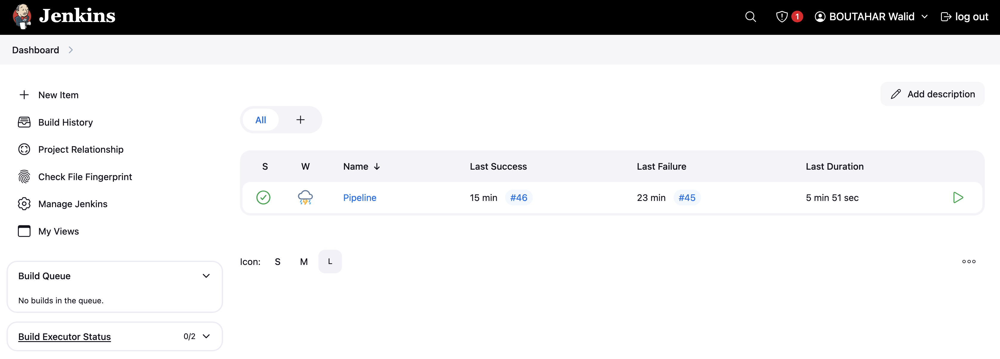
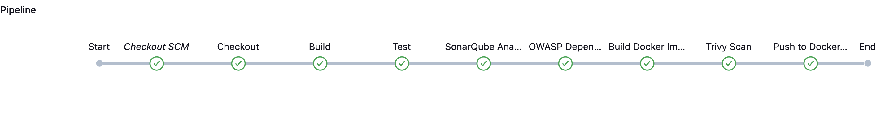
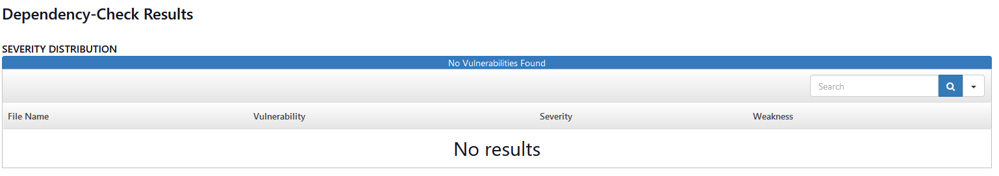
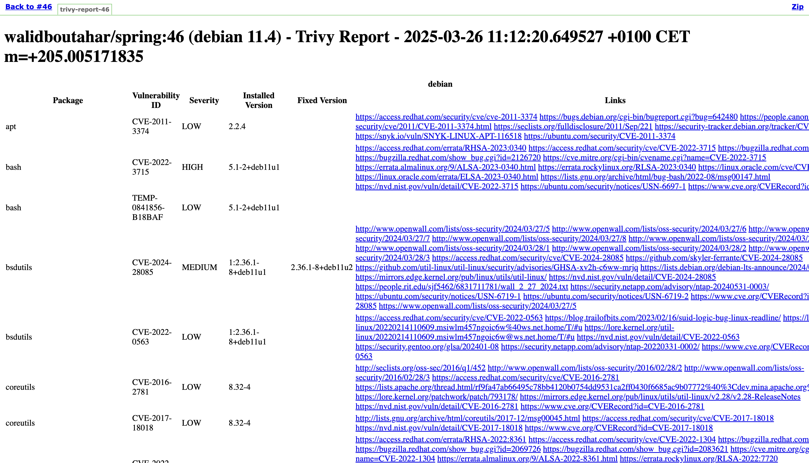
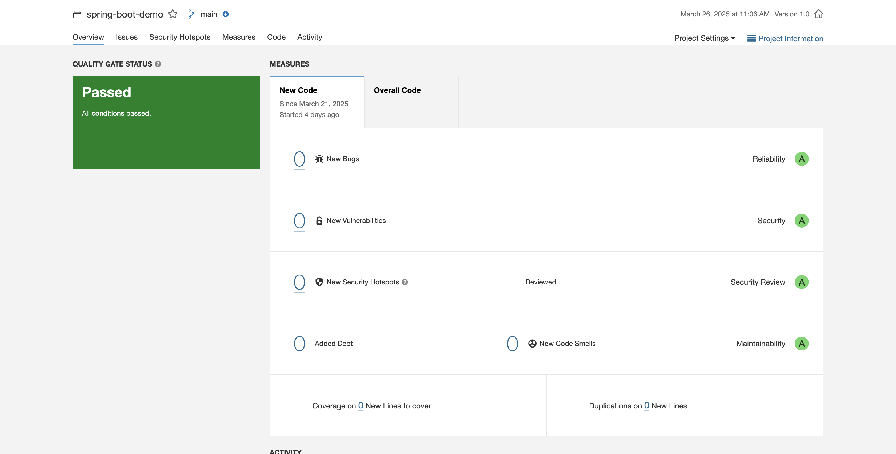

# Jenkins CI/CD Pipeline with Security Scanning

## Project Overview

This project implements a **Jenkins CI/CD pipeline** for a **Spring Boot** application, integrating **security scanning** and **code quality checks** to ensure a robust and secure software development lifecycle. The pipeline is configured to work with the following tools:


- **GitHub**: Version control system for source code management.
- **Maven**: Build automation tool for compiling, testing, and packaging the application.
- **SonarQube**: Static code analysis for code quality and security vulnerabilities.
- **OWASP Dependency Check**: Scans project dependencies for known security vulnerabilities.
- **Docker & Trivy**: Containerization and security scanning for Docker images.
- **Docker Hub**: Cloud-based registry for storing and sharing Docker images.

## Pipeline Features

- **Automated code checkout** from GitHub.
- **Build and test execution** using Maven.
- **Static code analysis** with SonarQube.
- **Security scanning** of dependencies using OWASP Dependency Check.
- **Docker image building** and **security scanning** with Trivy.
- **Automated Docker image publishing** to Docker Hub.



## Pipeline Components

### Jenkins Pipeline Script

The Jenkins pipeline automates the CI/CD process using **Declarative Pipeline syntax**.

```groovy
pipeline {
    agent any

    environment {
        SONARQUBE_SERVER = 'sonar-server'
        GITHUB_REPO = 'https://github.com/walidcd/CICD-pipeline-with-Jenkins-Sonar.git'
        SONAR_PROJECT_KEY = credentials('sonar-project')
        SONARQUBE_TOKEN = credentials('sonar-token')
        NVD_API_KEY = credentials('NVD-API')
        DOCKERHUB_CREDENTIALS = "docker-hub-credentials-id"
        DOCKER_IMAGE_NAME = 'walidboutahar/spring'
        PATH = "/opt/homebrew/bin:${env.PATH}"
        DOCKER_HOST = "unix://$HOME/.docker/run/docker.sock"
        DOCKER_HUB_PASSWORD = credentials('DOCKER_HUB_PASSWORD')
    }

    stages {
        stage('Checkout') {
            steps {
                git branch: 'main', url: "${GITHUB_REPO}"
            }
        }

        stage('Build') {
            steps {
                sh 'chmod +x mvnw'
                sh './mvnw clean install'
            }
        }

        stage('Test') {
            steps {
                sh './mvnw test'
            }
        }

        stage('SonarQube Analysis') {
            steps {
                script {
                    withSonarQubeEnv("${SONARQUBE_SERVER}") {
                        sh "./mvnw sonar:sonar " +
                           "-Dsonar.projectKey=${SONAR_PROJECT_KEY} " +
                           "-Dsonar.login=${SONARQUBE_TOKEN}"
                    }
                }
            }
        }

        stage('OWASP Dependency Check') {
            steps {
                script {
                    dependencyCheck(
                        additionalArguments: "--prettyPrint --scan ./",
                        odcInstallation: "dependency-check"
                    )
                }
            }
        }

        stage('Build Docker Image') {
            steps {
                script {
                    sh "docker build -t ${DOCKER_IMAGE_NAME}:${env.BUILD_NUMBER} ."
                }
            }
        }

        stage('Trivy Scan') {
            steps {
                script {
                    def trivyHtmlReportFile = "trivy-report-${env.BUILD_NUMBER}.html"
                    sh "trivy image --format template --template @/opt/homebrew/share/trivy/templates/html.tpl ${DOCKER_IMAGE_NAME}:${env.BUILD_NUMBER} > ${trivyHtmlReportFile}"
                    publishHTML([
                        reportName: 'Trivy Security Scan',
                        reportDir: '',
                        reportFiles: trivyHtmlReportFile,
                        keepAll: true,
                        allowMissing: false,
                        alwaysLinkToLastBuild: true,
                        includes: '**/*'
                    ])
                }
            }
        }

        stage('Push Docker Image to DockerHub') {
            steps {
                script {
                    withDockerRegistry([credentialsId: "docker-hub-credentials-id", url: "https://index.docker.io/v1/"]) {
                        sh "docker push ${DOCKER_IMAGE_NAME}:${env.BUILD_NUMBER}"
                    }
                }
            }
        }
    }
}
```

## Security Scanning

### OWASP Dependency Check

OWASP Dependency Check scans project dependencies for known vulnerabilities and generates detailed reports.

- **Purpose**: Identifies known security flaws in third-party libraries.
- **Report Output**: Generates an HTML report accessible via Jenkins.



### Trivy - Docker Security Scanning

Trivy is used to scan the Docker image for vulnerabilities **before deployment**.

- **Purpose**: Detects security issues in system packages and application dependencies.
- **Report Output**: HTML report integrated into Jenkins.



### SonarQube - Static Code Analysis

SonarQube is a powerful tool that analyzes source code for bugs, vulnerabilities, and code smells.

- **Purpose**: Ensures high code quality and security compliance.
- **Integration**: Runs automatically after code compilation.



## Docker Build and Deployment

The pipeline builds a **Docker image** and publishes it to **Docker Hub**.

### Dockerfile

```Dockerfile
FROM maven:3.8.6-jdk-11-slim AS build
WORKDIR /app
COPY . .
RUN mvn clean package

FROM openjdk:11-jre-slim
WORKDIR /app
COPY --from=build /app/target/*.jar app.jar
EXPOSE 8989
CMD ["java", "-jar", "app.jar"]
```

### Deployment Workflow

1. **Code Commit** triggers Jenkins pipeline.
2. **Maven builds and tests** the application.
3. **SonarQube** runs static code analysis.
4. **OWASP Dependency Check** scans dependencies for vulnerabilities.
5. **Docker image is built** using a multi-stage process.
6. **Trivy security scan** checks for vulnerabilities in the Docker image.
7. **Validated image is pushed** to Docker Hub.


## Conclusion

This Jenkins CI/CD pipeline ensures a **secure, high-quality, and automated** software development workflow. By integrating **SonarQube, OWASP Dependency Check, and Trivy**, it enforces best practices in **code security and container security** before deployment.
